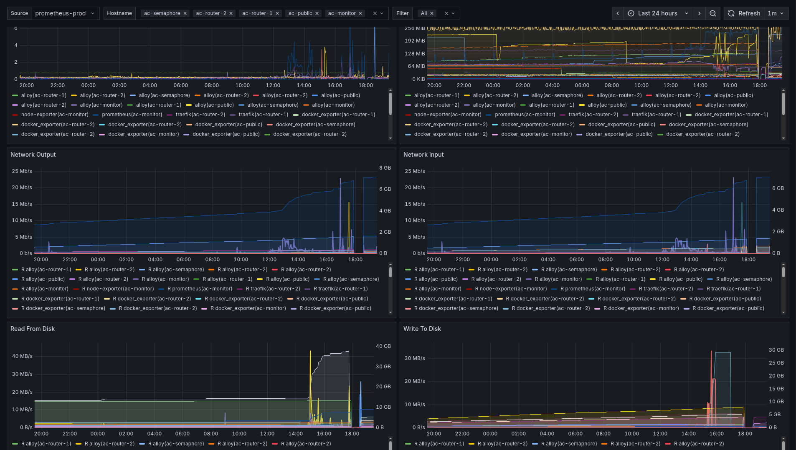
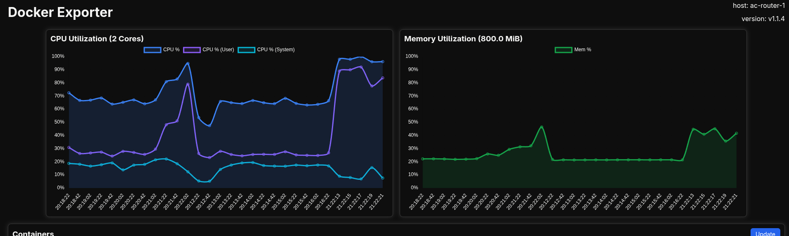
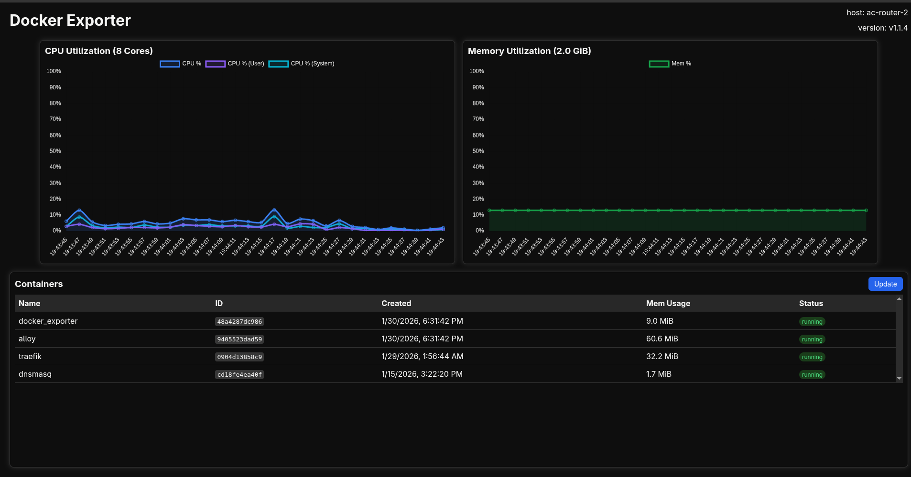

# Docker Prometheus Exporter

This project is similar to [prometheus-podman-exporter](https://github.com/containers/prometheus-podman-exporter), but for Docker containers rather than Podman containers.
It serves as a more lightweight alternative to Cadvisor, consuming approximately 20MB of RAM instead of 150–200MB.
It exports Docker container metrics in Prometheus format and also provides a simple homepage with live charts for cpu and memory usage.

Grafana dashboard is available at [dashboard.json](./dashboard.json)


## Exported Metrics

The exporter provides the following metrics:

| Metric Name                                     | Description                                                                                  | Collector       | Type    | Labels                                                                    |
|-------------------------------------------------|----------------------------------------------------------------------------------------------|-----------------|---------|---------------------------------------------------------------------------|
| `docker_exporter_info`                          | Information about the docker exporter                                                        | system          | -       | `hostname`, `version`                                                     |
| `docker_exporter_host_os_info`                  | Information about the host operating system                                                  | system          | -       | `hostname`, `os_name`, `os_version`                                       |
| `docker_disk_usage_container_total_size`        | Information about Size of containers on disk.                                                | system          | Gauge   | `hostname`                                                                |
| `docker_disk_usage_container_reclaimable`       | Information about Size of containers on disk that can be reclaimed.                          | system          | Gauge   | `hostname`                                                                |
| `docker_disk_usage_images_total_size`           | Information about Size of images on disk.                                                    | system          | Gauge   | `hostname`                                                                |
| `docker_disk_usage_images_reclaimable`          | Information about Size of images on disk that can be reclaimed.                              | system          | Gauge   | `hostname`                                                                |
| `docker_disk_usage_build_cache_total_size`      | Information about Size of build cache on disk.                                               | system          | Gauge   | `hostname`                                                                |
| `docker_disk_usage_build_cache_reclaimable`     | Information about Size of build on disk that can be reclaimed.                               | system          | Gauge   | `hostname`                                                                |
| `docker_disk_usage_volumes_total_size`          | Information about Size of volumes on disk.                                                   | system          | Gauge   | `hostname`                                                                |
| `docker_disk_usage_volumes_reclaimable`         | Information about Size of volumes on disk that can be reclaimed.                             | system          | Gauge   | `hostname`                                                                |
| `docker_container_info`                         | Container information                                                                        | system          | -       | `hostname`, `container_id`, `name`, `image_id`, `command`, `network_mode` |
| `docker_container_name`                         | Name for the container (can be more than one)                                                | container       | -       | `hostname`, `container_id`, `name`                                        |
| `docker_container_state`                        | Container State (0=created, 1=running, 2=paused, 3=restarting, 4=removing, 5=exited, 6=dead) | container       | Gauge   | `hostname`, `container_id`                                                |
| `docker_container_created_seconds`              | Timestamp in seconds when the container was created                                          | container       | Gauge   | `hostname`, `container_id`                                                |
| `docker_container_started_seconds`              | Timestamp in seconds when the container was started                                          | container       | Gauge   | `hostname`, `container_id`                                                |
| `docker_container_finished_at_seconds`          | Timestamp in seconds when the container finished                                             | container       | Gauge   | `hostname`, `container_id`                                                |
| `docker_container_ports`                        | Forwarded Ports                                                                              | container       | -       | `hostname`, `container_id`, `public_port`, `private_port`, `ip`, `type`   |
| `docker_container_exit_code`                    | Exit code of the container                                                                   | container       | Gauge   | `hostname`, `container_id`                                                |
| `docker_container_restart_count`                | Number of times the container has been restarted                                             | container       | Counter | `hostname`, `container_id`                                                |
| `docker_container_rootfs_size_bytes`            | Size of rootfs in this container in bytes                                                    | container.fs    | Gauge   | `hostname`, `container_id`                                                |
| `docker_container_rw_size_bytes`                | Size of files that have been created or changed by this container in bytes                   | container.fs    | Gauge   | `hostname`, `container_id`                                                |
| `docker_container_pids`                         | Number of processes running in the container                                                 | container.stats | Gauge   | `hostname`, `container_id`                                                |
| `docker_container_cpu_user_nanoseconds_total`   | Time (in nanoseoconds) spent by tasks                                                        | container.stats | Counter | `hostname`, `container_id`                                                |
| `docker_container_cpu_kernel_nanoseconds_total` | Time (in nanoseoconds) spent by tasks in user mode                                           | container.stats | Counter | `hostname`, `container_id`                                                |
| `docker_container_cpu_nanoseconds_total`        | Time (in nanoseoconds) spent by tasks in kernel mode                                         | container.stats | Counter | `hostname`, `container_id`                                                |
| `docker_container_cpu_percent`                  | Percentage of CPU used by the container (relative to max available CPU cores)                | container.stats | Gauge   | `hostname`, `container_id`                                                |
| `docker_container_cpu_percent_host`             | Percentage of CPU used by the container (relative to host CPU cores)                         | container.stats | Gauge   | `hostname`, `container_id`                                                |
| `docker_container_mem_limit_kib`                | Container memory limit in KiB                                                                | container.stats | Gauge   | `hostname`, `container_id`                                                |
| `docker_container_mem_usage_kib`                | Container memory usage in KiB                                                                | container.stats | Gauge   | `hostname`, `container_id`                                                |
| `docker_container_block_input_total`            | Total number of bytes read from disk                                                         | container.stats | Counter | `hostname`, `container_id`                                                |
| `docker_container_block_output_total`           | Total number of bytes written to disk                                                        | container.stats | Counter | `hostname`, `container_id`                                                |
| `docker_container_net_send_bytes_total`         | Total number of bytes sent                                                                   | container.net   | Counter | `hostname`, `container_id`                                                |
| `docker_container_net_send_dropped_total`       | Total number of send packet drop                                                             | container.net   | Counter | `hostname`, `container_id`                                                |
| `docker_container_net_send_errors_total`        | Total number of send errors                                                                  | container.net   | Counter | `hostname`, `container_id`                                                |
| `docker_container_net_receive_bytes_total`      | Total number of bytes received                                                               | container.net   | Counter | `hostname`, `container_id`                                                |
| `docker_container_net_receive_dropped_total`    | Total number of receive packet drop                                                          | container.net   | Counter | `hostname`, `container_id`                                                |
| `docker_container_net_receive_errors_total`     | Total number of receive errors                                                               | container.net   | Counter | `hostname`, `container_id`                                                |

`docker_container_rootfs_size_bytes` and `docker_container_rw_size_bytes` are cached and only updated every 5 minutes.
This can be customized with the `--cache.size-cache-seconds` flag.

`docker_exporter_host_os_info` reads from `/etc/os-release` and is cached with a 5-minute TTL. This allows the exporter
to detect OS version changes (e.g., after system updates) without requiring a container restart.

`docker_container_cpu_percent` should probably be preferred over `docker_container_cpu_percent_host` as it takes the
container's cgroup settings into account. (you can use `--cpus=3` to limit a container to only three cpu cores which
this metric will report correctly)

`docker_disk_usage_*` are cached and only updated every 2 minutes. This can be customized with the `--cache.disk-usage-cache-seconds` flag.



## Usage

### Command-line options

| Option                             | Description                                                | Default                       |
|------------------------------------|------------------------------------------------------------|-------------------------------|
| `--log.verbose`, `-v`              | Enable verbose mode (debug logs)                           | `false`                       |
| `--log.quiet`, `-q`                | Enable quiet mode (disable info logs)                      | `false`                       |
| `--log.trace`                      | Enable trace mode (very vebose logs)                       | `false`                       |
| `--log.format`                     | Log format: 'logfmt' or 'json'                             | `logfmt`                      |
| `--collector.internal-metrics`     | Enable internal go metrics                                 | `false`                       |
| `--cache.size-cache-duration`      | Duration to wait before refreshing container size cache    | `300s`                        |
| `--cache.disk-usage-cache-seconds` | Duration to wait before refreshing docker disk usage cache | `120s`                        |
| `--web.homepage`                   | Show homepage with charts.                                 | `true`                        |
| `--web.address`, `-a`              | Address to listen on                                       | `0.0.0.0`                     |
| `--web.port`, `-p`                 | Port to listen on                                          | `9100`                        |
| `--docker-host`, `-d`              | Host to connect to                                         | `unix:///var/run/docker.sock` |
| `--collector.system`               | Enable system collector (exporter info, host OS info).     | `true`                        |
| `--collector.container`            | Enable container collector.                                | `true`                        |
| `--collector.container.net`        | Enable container network collector.                        | `true`                        |
| `--collector.container.cpu`        | Enable container cpu usage collector.                      | `true`                        |
| `--collector.container.fs`         | Enable container fs collector.                             | `true`                        |
| `--collector.container.stats`      | Enable container stats collector.                          | `true`                        |

### Endpoints

- `/metrics` - Prometheus metrics endpoint
- `/status` - Status endpoint
- `/` - Homepage with live charts
- `/api` - Api used by homepage for graphs and container info

<table>
  <tr>
    <td></td>
    <td></td>
  </tr>
</table>

### Logging

The exporter uses structured logging with support for multiple output formats:

- **logfmt** (default): Human-readable key-value format, compatible with log aggregation tools like Grafana Alloy
- **json**: JSON-formatted logs for easy parsing and integration with log processing systems

Logs include contextual information such as container IDs, error details, and operation metadata. Use `--verbose` to
enable debug-level logs with additional details about container operations.

Example logfmt output:

```
time=2025-12-18T17:12:19.779Z level=INFO msg="Starting Docker Prometheus exporter" version=dev uid=1001 gid=1001 docker_host=unix:///var/run/docker.sock
```

Example JSON output:

```json
{
  "time": "2025-12-18T17:12:27.549Z",
  "level": "INFO",
  "msg": "Starting Docker Prometheus exporter",
  "version": "dev",
  "uid": 1001,
  "gid": 1001,
  "docker_host": "unix:///var/run/docker.sock"
}
```

### Status endpoint

- Healthy
  ```json
  {
    "status": "healthy",
    "dockerVersion": "1.53",
    "version": "v1.3.1"
  }
  ```
- Starting
  ```json
  {
    "status": "starting",
    "dockerVersion": "1.53",
    "version": "v1.3.1"
  }
  ```

- Unhealthy
  ```json
  {
    "status": "unhealthy",
    "errors": {
      "ListAllRunningContainers": "Cannot connect to the Docker daemon at unix:///var/run/docker.sock. Is the docker daemon running?",
      "readHostname": "open /etc/hostname: no such file or directory"
    },
    "dockerError": "Cannot connect to the Docker daemon at unix:///var/run/docker.sock. Is the docker daemon running?",
    "version": "v1.3.1"
  }
  ```

### Example Metrics

```shell
# HELP docker_container_block_input_total Total number of bytes read from disk
# TYPE docker_container_block_input_total counter
docker_container_block_input_total{container_id="1bc4f77b45da7141bd451a12a61abd5c33b04276a3c06bb7a2b805d76eb0895e",hostname="arch-laptop"} 2.71532032e+08
# HELP docker_container_block_output_total Total number of bytes written to disk
# TYPE docker_container_block_output_total counter
docker_container_block_output_total{container_id="1bc4f77b45da7141bd451a12a61abd5c33b04276a3c06bb7a2b805d76eb0895e",hostname="arch-laptop"} 0
# HELP docker_container_cpu_kernel_nanoseconds_total Time (in nanoseconds) spent by tasks in kernel mode
# TYPE docker_container_cpu_kernel_nanoseconds_total counter
docker_container_cpu_kernel_nanoseconds_total{container_id="1bc4f77b45da7141bd451a12a61abd5c33b04276a3c06bb7a2b805d76eb0895e",hostname="arch-laptop"} 3.9633e+08
# HELP docker_container_cpu_nanoseconds_total Time (in nanoseconds) spent by tasks
# TYPE docker_container_cpu_nanoseconds_total counter
docker_container_cpu_nanoseconds_total{container_id="1bc4f77b45da7141bd451a12a61abd5c33b04276a3c06bb7a2b805d76eb0895e",hostname="arch-laptop"} 6.1533e+08
# HELP docker_container_cpu_percent Percentage of CPU used by the container (relative to max available CPU cores)
# TYPE docker_container_cpu_percent gauge
docker_container_cpu_percent{container_id="1bc4f77b45da7141bd451a12a61abd5c33b04276a3c06bb7a2b805d76eb0895e",hostname="arch-laptop"} 0
# HELP docker_container_cpu_percent_host Percentage of CPU used by the container (relative to host CPU cores)
# TYPE docker_container_cpu_percent_host gauge
docker_container_cpu_percent_host{container_id="1bc4f77b45da7141bd451a12a61abd5c33b04276a3c06bb7a2b805d76eb0895e",hostname="arch-laptop"} 0
# HELP docker_container_cpu_user_nanoseconds_total Time (in nanoseconds) spent by tasks in user mode
# TYPE docker_container_cpu_user_nanoseconds_total counter
docker_container_cpu_user_nanoseconds_total{container_id="1bc4f77b45da7141bd451a12a61abd5c33b04276a3c06bb7a2b805d76eb0895e",hostname="arch-laptop"} 2.18999e+08
# HELP docker_container_created_seconds Timestamp in seconds when the container was created
# TYPE docker_container_created_seconds counter
docker_container_created_seconds{container_id="1bc4f77b45da7141bd451a12a61abd5c33b04276a3c06bb7a2b805d76eb0895e",hostname="arch-laptop"} 1.770042164e+09
# HELP docker_container_exit_code Exit code of the container
# TYPE docker_container_exit_code gauge
docker_container_exit_code{container_id="1bc4f77b45da7141bd451a12a61abd5c33b04276a3c06bb7a2b805d76eb0895e",hostname="arch-laptop"} 0
# HELP docker_container_finished_at_seconds Timestamp in seconds when the container finished
# TYPE docker_container_finished_at_seconds gauge
docker_container_finished_at_seconds{container_id="1bc4f77b45da7141bd451a12a61abd5c33b04276a3c06bb7a2b805d76eb0895e",hostname="arch-laptop"} 1.771622617e+09
# HELP docker_container_info Container information
# TYPE docker_container_info counter
docker_container_info{command="/bin/tini -- /docker-entry.sh /server",container_id="1bc4f77b45da7141bd451a12a61abd5c33b04276a3c06bb7a2b805d76eb0895e",hostname="arch-laptop",image_id="sha256:f5df598812f3425efeeebf026c66646042295eacd571de865632108c28a860f9",name="server-esp32-timelapse-server-1",network_mode="server_default"} 1
# HELP docker_container_mem_limit_kib Container memory limit in KiB
# TYPE docker_container_mem_limit_kib gauge
docker_container_mem_limit_kib{container_id="1bc4f77b45da7141bd451a12a61abd5c33b04276a3c06bb7a2b805d76eb0895e",hostname="arch-laptop"} 3.2557936e+07
# HELP docker_container_mem_usage_kib Container memory usage in KiB
# TYPE docker_container_mem_usage_kib gauge
docker_container_mem_usage_kib{container_id="1bc4f77b45da7141bd451a12a61abd5c33b04276a3c06bb7a2b805d76eb0895e",hostname="arch-laptop"} 194852
# HELP docker_container_name Name for the container (can be more than one)
# TYPE docker_container_name counter
docker_container_name{container_id="1bc4f77b45da7141bd451a12a61abd5c33b04276a3c06bb7a2b805d76eb0895e",hostname="arch-laptop",name="server-esp32-timelapse-server-1"} 1
# HELP docker_container_net_receive_bytes_total Total number of bytes received
# TYPE docker_container_net_receive_bytes_total counter
docker_container_net_receive_bytes_total{container_id="1bc4f77b45da7141bd451a12a61abd5c33b04276a3c06bb7a2b805d76eb0895e",hostname="arch-laptop"} 131827
# HELP docker_container_net_receive_dropped_total Total number of receive packet drop
# TYPE docker_container_net_receive_dropped_total counter
docker_container_net_receive_dropped_total{container_id="1bc4f77b45da7141bd451a12a61abd5c33b04276a3c06bb7a2b805d76eb0895e",hostname="arch-laptop"} 0
# HELP docker_container_net_receive_errors_total Total number of receive errors
# TYPE docker_container_net_receive_errors_total counter
docker_container_net_receive_errors_total{container_id="1bc4f77b45da7141bd451a12a61abd5c33b04276a3c06bb7a2b805d76eb0895e",hostname="arch-laptop"} 0
# HELP docker_container_net_send_bytes_total Total number of bytes sent
# TYPE docker_container_net_send_bytes_total counter
docker_container_net_send_bytes_total{container_id="1bc4f77b45da7141bd451a12a61abd5c33b04276a3c06bb7a2b805d76eb0895e",hostname="arch-laptop"} 126
# HELP docker_container_net_send_dropped_total Total number of send packet drop
# TYPE docker_container_net_send_dropped_total counter
docker_container_net_send_dropped_total{container_id="1bc4f77b45da7141bd451a12a61abd5c33b04276a3c06bb7a2b805d76eb0895e",hostname="arch-laptop"} 0
# HELP docker_container_net_send_errors_total Total number of send errors
# TYPE docker_container_net_send_errors_total counter
docker_container_net_send_errors_total{container_id="1bc4f77b45da7141bd451a12a61abd5c33b04276a3c06bb7a2b805d76eb0895e",hostname="arch-laptop"} 0
# HELP docker_container_pids Number of processes running in the container
# TYPE docker_container_pids gauge
docker_container_pids{container_id="1bc4f77b45da7141bd451a12a61abd5c33b04276a3c06bb7a2b805d76eb0895e",hostname="arch-laptop"} 18
# HELP docker_container_ports Forwarded Ports
# TYPE docker_container_ports gauge
docker_container_ports{container_id="1bc4f77b45da7141bd451a12a61abd5c33b04276a3c06bb7a2b805d76eb0895e",hostname="arch-laptop",ip="0.0.0.0",private_port="8080",public_port="8080",type="tcp"} 1
docker_container_ports{container_id="1bc4f77b45da7141bd451a12a61abd5c33b04276a3c06bb7a2b805d76eb0895e",hostname="arch-laptop",ip="::",private_port="8080",public_port="8080",type="tcp"} 1
# HELP docker_container_restart_count Number of times the container has been restarted
# TYPE docker_container_restart_count counter
docker_container_restart_count{container_id="1bc4f77b45da7141bd451a12a61abd5c33b04276a3c06bb7a2b805d76eb0895e",hostname="arch-laptop"} 0
# HELP docker_container_rootfs_size_bytes Size of rootfs in this container in bytes
# TYPE docker_container_rootfs_size_bytes gauge
docker_container_rootfs_size_bytes{container_id="1bc4f77b45da7141bd451a12a61abd5c33b04276a3c06bb7a2b805d76eb0895e",hostname="arch-laptop"} 7.30769752e+08
# HELP docker_container_rw_size_bytes Size of files that have been created or changed by this container in bytes
# TYPE docker_container_rw_size_bytes gauge
docker_container_rw_size_bytes{container_id="1bc4f77b45da7141bd451a12a61abd5c33b04276a3c06bb7a2b805d76eb0895e",hostname="arch-laptop"} 0
# HELP docker_container_started_seconds Timestamp in seconds when the container was started
# TYPE docker_container_started_seconds gauge
docker_container_started_seconds{container_id="1bc4f77b45da7141bd451a12a61abd5c33b04276a3c06bb7a2b805d76eb0895e",hostname="arch-laptop"} 1.771622693e+09
# HELP docker_container_state Container State (0=created, 1=running, 2=paused, 3=restarting, 4=removing, 5=exited, 6=dead)
# TYPE docker_container_state gauge
docker_container_state{container_id="1bc4f77b45da7141bd451a12a61abd5c33b04276a3c06bb7a2b805d76eb0895e",hostname="arch-laptop"} 1
# HELP docker_disk_usage_build_cache_reclaimable Information about Size of build on disk that can be reclaimed.
# TYPE docker_disk_usage_build_cache_reclaimable gauge
docker_disk_usage_build_cache_reclaimable{hostname="arch-laptop"} 2.136523696e+09
# HELP docker_disk_usage_build_cache_total_size Information about Size of build cache on disk.
# TYPE docker_disk_usage_build_cache_total_size gauge
docker_disk_usage_build_cache_total_size{hostname="arch-laptop"} 2.219766813e+09
# HELP docker_disk_usage_container_reclaimable Information about Size of containers on disk that can be reclaimed.
# TYPE docker_disk_usage_container_reclaimable gauge
docker_disk_usage_container_reclaimable{hostname="arch-laptop"} 0
# HELP docker_disk_usage_container_total_size Information about Size of containers on disk.
# TYPE docker_disk_usage_container_total_size gauge
docker_disk_usage_container_total_size{hostname="arch-laptop"} 0
# HELP docker_disk_usage_images_reclaimable Information about Size of images on disk that can be reclaimed.
# TYPE docker_disk_usage_images_reclaimable gauge
docker_disk_usage_images_reclaimable{hostname="arch-laptop"} 7.30769781e+08
# HELP docker_disk_usage_images_total_size Information about Size of images on disk.
# TYPE docker_disk_usage_images_total_size gauge
docker_disk_usage_images_total_size{hostname="arch-laptop"} 8.89047521e+08
# HELP docker_disk_usage_volumes_reclaimable Information about Size of volumes on disk that can be reclaimed.
# TYPE docker_disk_usage_volumes_reclaimable gauge
docker_disk_usage_volumes_reclaimable{hostname="arch-laptop"} 7.765450422e+09
# HELP docker_disk_usage_volumes_total_size Information about Size of volumes on disk.
# TYPE docker_disk_usage_volumes_total_size gauge
docker_disk_usage_volumes_total_size{hostname="arch-laptop"} 7.765450422e+09
# HELP docker_exporter_host_os_info Information about the host operating system
# TYPE docker_exporter_host_os_info counter
docker_exporter_host_os_info{hostname="arch-laptop",os_name="Arch",os_version="Unknown"} 1
# HELP docker_exporter_info Information about the docker exporter
# TYPE docker_exporter_info counter
docker_exporter_info{hostname="arch-laptop",version="main"} 1
```

### Running the exporter

```bash
# Run with default settings
./docker-exporter

# Run with custom port and address, disable fs collector
./docker-exporter --web.port 9101 --web.address 127.0.0.1 --collector.container.fs=false

# Enable verbose logging and disable homepage
./docker-exporter --log.verbose --web.homepage=false

# Use JSON log format
./docker-exporter --log.format=json

# Enable internal metrics and use docker with tcp socket
./docker-exporter --collector.internal-metrics --docker-host tcp://127.0.0.1:2375
```

## Run with docker

```bash
docker run -d --name docker-exporter \
  -e IP="$(ip route get 1.1.1.1 | head -1 | awk '{print $7}')" \
  -e TZ="Europe/Berlin" -p 9100:9100 \
  -v /var/run/docker.sock:/var/run/docker.sock:ro -v /proc/stat:/proc/stat:ro -v /proc/meminfo:/proc/meminfo:ro \
  -v /etc/hostname:/etc/hostname:ro -v /etc/os-release:/etc/os-release:ro \
  ghcr.io/h3rmt/docker-exporter:latest -p 9100 --log.format logfmt --log.verbose
```

## Run with docker-compose

```yaml
services:
  docker_exporter:
    image: ghcr.io/h3rmt/docker-exporter:latest
    container_name: docker_exporter
    restart: always
    environment:
      - TZ="Europe/Berlin"
      - IP="10.10.10.10"
    volumes:
      - /var/run/docker.sock:/var/run/docker.sock:ro
      - /etc/hostname:/etc/hostname:ro
      - /etc/os-release:/etc/os-release:ro
      - /proc/stat:/proc/stat:ro
      - /proc/meminfo:/proc/meminfo:ro
    ports:
      - 9100:9100
    command: [ "--cache.size-cache-seconds=600", "--log.format=json" ]
```

## Building from source

```bash
go build -o docker-exporter ./cmd/main.go
```

### Running in docker in lxc

When running in docker in lxc mem and cpu metrics are either collected from the host or from the container depending on
the container's cgroup settings.
To collect metrics from the lxc container running the docker container a helper script is needed to access /proc/meminfo
in the lxc.

```bash
#!/usr/bin/env bash
FILE=./meminfo
echo "Starting meminfo script on $FILE"
# Check if it's a directory and remove it, or exit if it's a file
if [[ -d $FILE ]]; then
    echo "Directory $FILE exists. Removing."
    rm -rf "$FILE"
elif [[ -f $FILE ]]; then
    echo "File $FILE already exists. Exiting."
    exit 1
fi

trap 'rm -f $FILE' EXIT
# Continuously copy /proc/meminfo to ./meminfo every 2 seconds
while true; do
cat /proc/meminfo > "$FILE"
sleep 2
done
```

Start this script as a daemon and mount the resulting file as a volume.

```yaml
services:
  docker_exporter:
    image: ghcr.io/h3rmt/docker-exporter:latest
    container_name: docker_exporter
    restart: always
    environment:
      - TZ="Europe/Berlin"
      - IP="10.10.10.10"
    volumes:
      - /var/run/docker.sock:/var/run/docker.sock:ro
      - /etc/hostname:/etc/hostname:ro
      - /etc/os-release:/etc/os-release:ro
      - /proc/stat:/proc/stat:ro
      # mount the meminfo file from the script as a volume
      - ./meminfo:/proc/meminfo:ro
    ports:
      - 9100:9100
    command: [ "--cache.size-cache-seconds=600", "--collector.internal-metrics" ]
```
